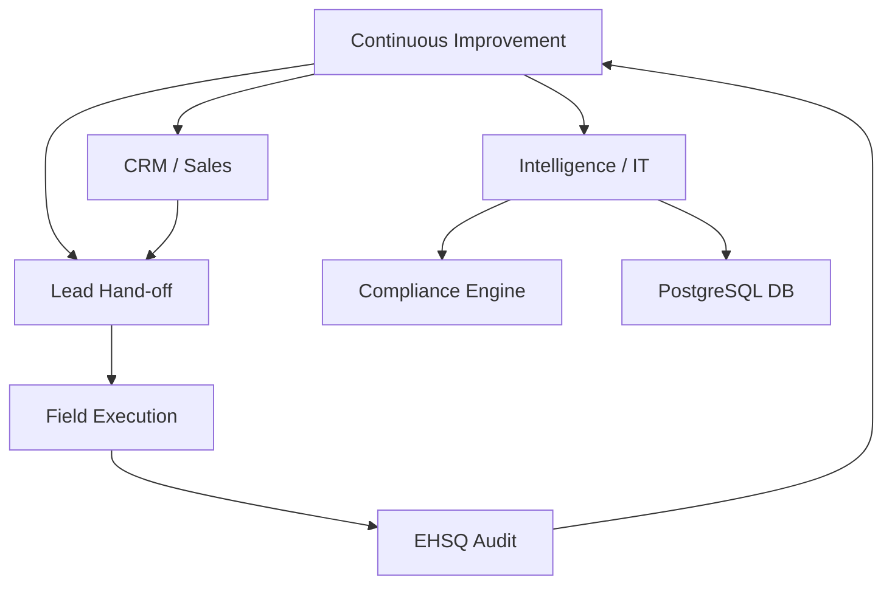

| **Document Control** |                                                    |
| :------------------- | :------------------------------------------------- |
| **Document Title**   | **Departmental Infrastructure and Governance SOP** |
| **Document ID**      | HWB-QMS-5.5                                        |
| **Version**          | 2.0.0                                              |
| **Status**           | APPROVED                                           |
| **Author**           | George (Architect)                                 |
| **Approved By**      | Humberto Dominguez, CEO                            |
| **Date**             | 05/21/2026                                         |
| **ISO 9001 Clause**  | 7.1.3 (Infrastructure)                             |

---

# Standard Operating Procedure: **Departmental Governance**

## 1.0 Purpose
This SOP defines the functional scope, responsibilities, and governance structure of HWB departments. It ensures all activities are organized into clear, manageable units that support the **SigmaFidelity™** digital and physical value chain.

## 2.0 Universal Mandates (2026 Baseline)
1. **Physical Truth:** Departmental governance is enforced via absolute server paths and Docker container isolation.
2. **Guidance First:** Cross-departmental logic changes require CEO guidance.
3. **Tier 6 Telemetry:** Every departmental interaction and handoff must be logged.

## 3.0 Departmental Registry

### 3.1 Executive & Strategy
*   **Scope:** Strategic leadership, financial oversight (Warchest), and QMS accountability.
*   **Infrastructure:** `/core`, `main_app.py`, and the Executive Pulse dashboard.

### 3.2 Operations & Field
*   **Scope:** Service delivery, mobile equipment logs, and technical sanitation.
*   **Infrastructure:** `/HWB-OPERATIONS`, `hwb-mobile-ops`.

### 3.3 Intelligence & IT
*   **Scope:** Digital infrastructure, system uptime, and AI agent orchestration.
*   **Infrastructure:** `/HWB-IT`, `hwb_compliance_engine`, `hwb_postgres_dev`.

### 3.4 Sales & CRM
*   **Scope:** Lead ingestion, client relationship intelligence, and proposal tracking.
*   **Infrastructure:** `/crm` partition, `SAM-Sync.py`, `Lead Ingestor.py`.

### 3.5 EHSQ (Environment, Health, Safety, Quality)
*   **Scope:** Safety compliance, ISO auditing, and risk management.
*   **Infrastructure:** `/HWB-EHSQ`, JHA digital forms, ATP testing records.

## 4.0 Infrastructure Flowchart

## 5.0 Verification (Zero-Defect Check)
*   Departmental folders follow the standardized naming convention.
*   All digital interactions are logged in the `SigmaInteractionLog`.

## 6.0 Revision History
| Version | Date | Author | Change Description |
| :--- | :--- | :--- | :--- |
| 2.0.0 | 05/21/2026 | George | TOTAL MODERNIZATION. Updated departmental infrastructure to reflect microservice and AI VP architecture. |
| 1.3 | 2026-02-28 | Gemini | Initial Release. |
