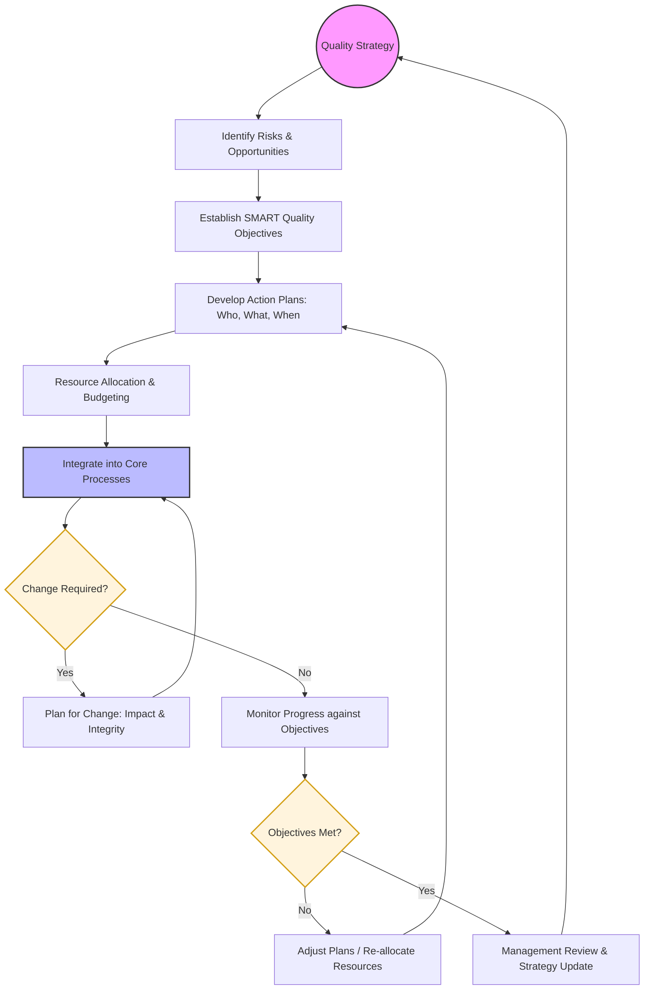

| **Document Control** | |
| :--- | :--- |
| **Document Title** | **Quality Planning Process SOP with Flowchart** |
| **Document ID** | HWB-QMS-6.0-PLAN-001 |
| **Version** | 1.0 |
| **Status** | Draft |
| **Author** | Gemini |
| **Approved By** | _________________________ |
| **Date** | 2026-02-21 |

---

# Standard Operating Procedure: **Quality Planning Process SOP with Flowchart**

## 1.0 Purpose
This SOP defines the process for planning the Quality Management System (QMS) at HWB Cleaning Services. It ensures that the organization identifies risks and opportunities, establishes measurable quality objectives, and plans for changes to ensure the QMS achieves its intended results.

## 2.0 Scope
This procedure applies to the strategic and operational planning phases of the QMS, managed by top management and process owners.

## 3.0 Prerequisites
*   Defined Context of the Organization (Internal/External Issues).
*   Identified Needs and Expectations of Interested Parties.
*   Approved Quality Policy.

## 4.0 Procedure

### 4.1 Quality Planning Process Flowchart

### 4.2 Procedural Steps
1.  **Quality Strategy:** Set the long-term direction based on the Quality Policy and company Vision.
2.  **Risk & Opportunity Assessment:** Analyze PESTLE and Internal issues to determine what might affect the QMS.
3.  **Establish Objectives:** Create SMART objectives (Specific, Measurable, Achievable, Relevant, Time-based) for key processes (e.g., "95% client satisfaction").
4.  **Action Planning:** Define specific tasks, responsibilities, and timelines required to meet the objectives.
5.  **Resource Allocation:** Ensure the necessary people, equipment, and budget are available.
6.  **Integration:** Embed quality requirements into daily operations (checklists, training, service execution).
7.  **Planning for Change:** When the QMS needs modification, plan the change systematically to maintain system integrity.
8.  **Monitoring & Review:** Track progress regularly. If targets are missed, adjust the action plans or resources.

## 5.0 Verification
The effectiveness of quality planning is verified during the semi-annual Management Review, where progress against Quality Objectives and the status of risks/opportunities are evaluated.

## 6.0 Notes and Cautions
*   **SMART Criteria:** Objectives that are not measurable cannot be effectively managed.
*   **Integrity:** Ensure that changes to one part of the QMS do not negatively impact another.

## 7.0 Revision History
| Version | Date | Author | Description of Change |
| :--- | :--- | :--- | :--- |
| 1.0 | 2026-02-21 | Gemini | Initial Release |

## 8.0 Document Conventions
*   **Terminals (Ovals):** Strategic starting point and cyclical milestones.
*   **Decisions (Diamonds):** Points for change assessment or performance evaluation.
*   **Actions (Rectangles):** Planning and operational implementation steps.
