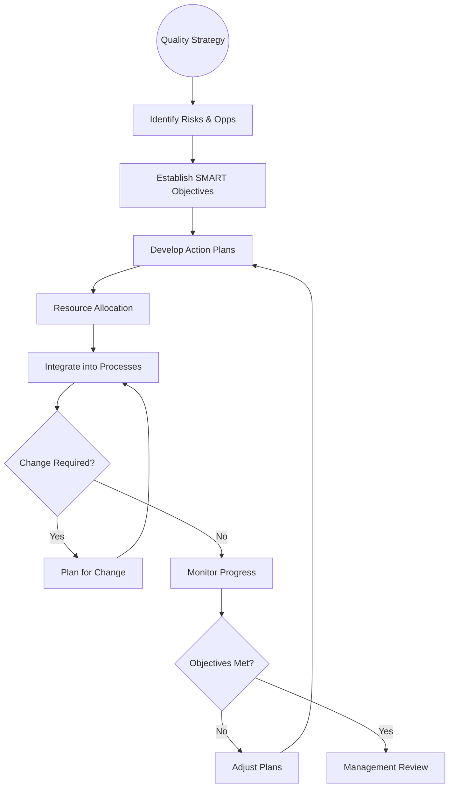

| **Document Control** |                                  |
| :------------------- | :------------------------------- |
| **Document Title**   | **Quality Planning Process SOP** |
| **Document ID**      | HWB-QMS-6.0                      |
| **Version**          | 2.0.0                            |
| **Status**           | APPROVED                         |
| **Author**           | George (Architect)               |
| **Approved By**      | Humberto Dominguez, CEO          |
| **Date**             | 05/21/2026                       |
| **ISO 9001 Clause**  | 6.0 (Planning)                   |

---

# Standard Operating Procedure: **Quality Planning Process**

## 1.0 Purpose
This SOP defines the process for planning the HWB Quality Management System. It ensures that the organization identifies risks and opportunities, establishes measurable (SMART) quality objectives, and plans for changes to ensure the QMS achieves its intended results.

## 2.0 Universal Mandates (2026 Baseline)
1. **Clinical Data Integrity:** Quality objectives must be derived from verified transactional records, never synthetic data.
2. **Tier 6 Telemetry:** Every planning cycle and strategic change must be logged.
3. **Physical Truth:** Reference absolute server paths for the **Master SOP Index**.

## 3.0 Quality Planning Workflow

## 4.0 Procedure
1.  **Objective Setting:** Create SMART objectives (e.g., "Achieve 98% lead ingestion fidelity").
2.  **Resource Mapping:** Allocate AI VPs and digital infrastructure to meet the objectives.
3.  **Change Control:** Before any system-wide change, ASK the CEO and log the plan in Tier 6.

## 5.0 Verification (Zero-Defect Check)
*   100% of quality objectives are linked to a specific ISO 9001 clause.
*   Monthly progress reports show zero deviations from the planning baseline.

## 6.0 Revision History
| Version | Date | Author | Change Description |
| :--- | :--- | :--- | :--- |
| 2.0.0 | 05/21/2026 | George | TOTAL MODERNIZATION. Added 2026 Baseline and Tier 6 mandates. |
| 1.0 | 2026-02-21 | Gemini | Initial Release. |
