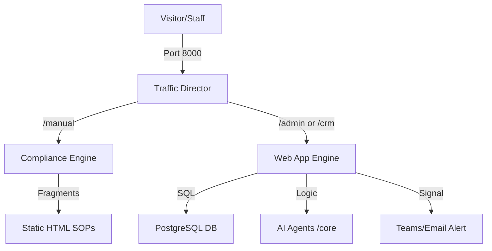

| **Document Control** |                                  |
| :------------------- | :------------------------------- |
| **Document Title**   | **Website Architectural Flowchart SOP** |
| **Document ID**      | HWB-QMS-7.1                      |
| **Version**          | 2.0.0                            |
| **Status**           | APPROVED                         |
| **Author**           | George (Architect)               |
| **Approved By**      | Humberto Dominguez, CEO          |
| **Date**             | 05/21/2026                       |
| **ISO 9001 Clause**  | 7.5.3 (Documented Information)   |

---

# Standard Operating Procedure: **Website Architectural Flowchart SOP**

## 1.0 Purpose
To define the visual and logical structure of the HWB Cleaning Services ecosystem. This SOP provides a technical roadmap of how the website interacts with the database, agents, and compliance engine.

## 2.0 Scope
Applies to the Main Web App (Flask), the Compliance Engine (Nginx), and the Traffic Director (Gateway).

## 3.0 Universal Mandates (2026 Baseline)
1. **Physical Truth:** All flowchart nodes must represent real server paths.
2. **Logic Proof:** Every path in this diagram must be verifiable at `mop.test:5000`.

## 4.0 Procedure

### 4.1 System Topology
The HWB infrastructure is decoupled into three primary segments:
1. **Public/CRM Segment:** Handles sales and lead ingestion.
2. **Compliance Segment:** Dedicated Nginx container for document control.
3. **Database Segment:** PostgreSQL persistence for all transactional records.

## 5.0 The Architectural Flowchart

## 6.0 Verification (Zero-Defect Check)
*   The flowchart renders correctly in the HTML manual index.
*   The "Traffic Director" correctly routes `/manual` to the Nginx host.
*   Database calls are being logged to Tier 6.

## 7.0 Notes and Cautions
> **LOGIC:** Using a separate Compliance Engine prevents OOM crashes on the main app.
> **CAUTION:** Do not change Gateway routing without a Peter Sentinel snapshot.

## 8.0 Revision History
| Version | Date | Author | Change Description |
| :--- | :--- | :--- | :--- |
| 2.0.0 | 05/21/2026 | George | TOTAL RECONSTRUCTION. Integrated the Microservice topology and Gateway routing. |

## 9.0 Document Conventions
* **Visual Standard:** Use Mermaid.js for all flowcharts.
