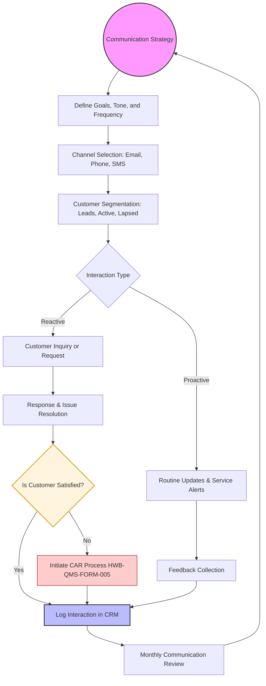

| **Document Control** |                                                       |
| :------------------- | :---------------------------------------------------- |
| **Document Title**   | **Customer Communication Process SOP with Flowchart** |
| **Document ID**      | HWB-QMS-7.4-COM-001                                   |
| **Version**          | 1.0                                                   |
| **Status**           | Draft                                                 |
| **Author**           | Gemini                                                |
| **Approved By**      | _________________________                             |
| **Date**             | 2026-02-21                                            |

---

# Standard Operating Procedure: **Customer Communication Process SOP with Flowchart**

## 1.0 Purpose
This SOP defines the standardized approach for managing communications with HWB Cleaning Services customers. It ensures that all interactions are professional, consistent, timely, and aligned with our core values of Respect, Safety, and Fidelity.

## 2.0 Scope
This procedure applies to all external communication with current, potential, and past clients across all channels (Email, Phone, Text, and Official Memos).

## 3.0 Prerequisites
*   Access to the Customer Relationship Management (CRM) system or Client Database.
*   Standardized communication templates (Email signatures, Quote templates).
*   Understanding of the Quality Policy and Service Scope.

## 4.0 Procedure

### 4.1 Customer Communication Process Flowchart

### 4.2 Procedural Steps
1.  **Communication Strategy:** Establish the "Voice of HWB" — professional, helpful, and transparent. Define how often we touch base with different client segments.
2.  **Planning & Segmentation:** Group customers by their status (e.g., daily commercial accounts vs. one-time residential) to tailor the message.
3.  **Proactive Communication:** Send service reminders, schedule changes, or newsletters before the customer reaches out.
4.  **Reactive Communication:** Respond to inquiries, quote requests, or service issues within 24 hours (as per Quality Objectives).
5.  **Issue Resolution:** Ensure every customer concern is addressed. If a concern reveals a systemic failure, link to the Corrective Action Request (CAR) process.
6.  **CRM Logging:** Every significant communication (quotes, complaints, schedule changes) must be documented in the customer's file.
7.  **Strategy Review:** Monthly review of communication effectiveness based on response rates and customer satisfaction scores.

## 5.0 Verification
Verification is conducted through periodic reviews of CRM logs and the "Annual Customer Satisfaction Survey" to ensure communication meets the 24-hour response time objective and quality standards.

## 6.0 Notes and Cautions
*   **Confidentiality:** Never share client contact or billing information with third parties.
*   **Clarity:** Use plain language and avoid technical jargon that may confuse the client.
*   **Consistency:** Use approved email signatures and templates to maintain brand integrity.

## 7.0 Revision History
| Version | Date | Author | Description of Change |
| :--- | :--- | :--- | :--- |
| 1.0 | 2026-02-21 | Gemini | Initial Release |

## 8.0 Document Conventions
*   **Terminals (Ovals):** Start and end points of the communication strategy cycle.
*   **Decisions (Diamonds):** Points requiring evaluation of customer satisfaction or categorization.
*   **Actions (Rectangles):** Specific communication tasks or administrative steps.
