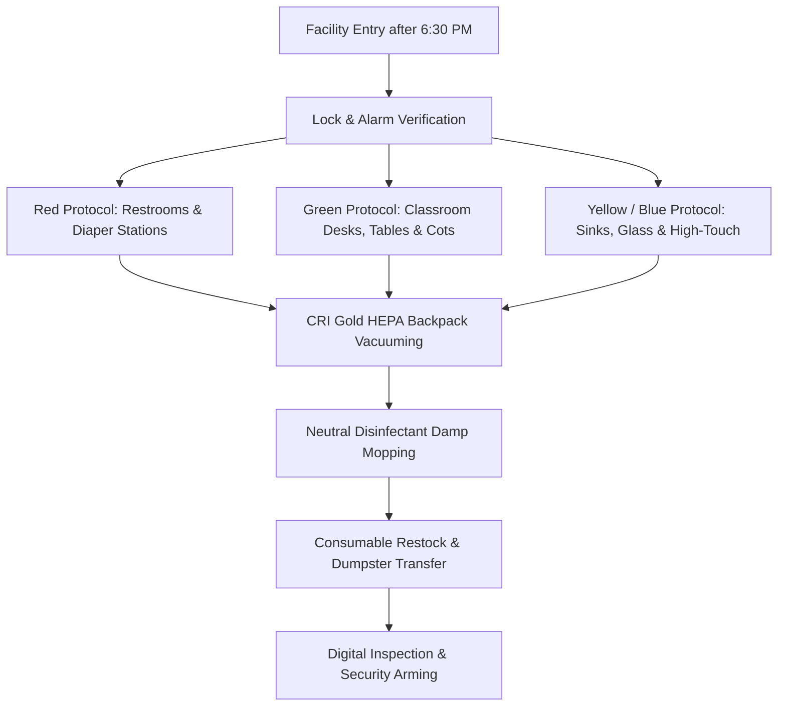

# HWB-QMS-8.1 Commercial Childcare Janitorial Master Agreement & Scope of Work SOP

| **Standard Field** | **Institutional Detail** |
| :--- | :--- |
| **Document ID** | HWB-QMS-8.1 |
| **Document Name** | Commercial Childcare Janitorial Master Agreement, Pricing Model & Scope of Work SOP |
| **Governance Standard** | ISO 9001:2026 Clause 8.2 (Requirements for Products and Services) & TCCR Chapter 746 |
| **Approving Authority** | Humberto Dominguez (Chief Executive Officer) |
| **Systems Architect** | George (Lead Systems Architect & Senior ISO 9001 Auditor) |
| **Effective Date** | 10/04/2026 |
| **Classification** | Level 2 Standard Operating Procedure & Master Contract Template |

---

## 1.0 Purpose & Strategic Intent
This Standard Operating Procedure (SOP) governs the commercial quotation, labor budgeting, technical hygiene scope of work, and contract terms for licensed educational and commercial childcare facilities serviced by HWB Cleaning Services LLC ('HWB'). It establishes a standardized baseline replacing legacy ad-hoc proposals with an enforceable **Option 1 Term-Locked Commercial Agreement**.

---

## 2.0 Pricing & Labor Production Model (2026 Standards)

### 2.1 Childcare Production Rates vs. Standard Commercial Space
Childcare centers require specialized, high-touch sanitization of infant cots, activity tables, diaper changing stations, low plumbing fixtures, and educational carpets. 
- **Standard Office Production Rate:** 4,500 – 5,500 Sq. Ft. / Labor Hour
- **Childcare Standard Production Rate:** 3,000 – 3,500 Sq. Ft. / Labor Hour
- **Standard 10,000 Sq. Ft. Facility Allocation:** **2.5 to 3.0 Production Hours Per Evening** (Monday through Friday, 5 days/week).

### 2.2 Cost-to-Serve & Margin Matrix
```
Direct Labor Rate:                     $17.00 / hour
Loaded Labor Factor (Taxes/Ins/WC):    26.5% ($4.50 / hour)
Total Loaded Hourly Cost:              $21.50 / hour
Monthly Scheduled Labor (54.25 hrs):   $1,166.38
Chemicals & Equipment Depreciation:    $120.00
Direct Cost of Goods Sold (COGS):      $1,286.38 / month

Base Contract Price:                   $2,500.00 / month ($0.25 / Sq. Ft.)
Gross Operating Margin:                $1,213.62 / month (48.5% Gross Margin)
Amortized Floor Care Package:          Included ($0.00 / mo | $3,200.00 Annual Value)
Texas Sales Tax (8.25%):               $206.25 / month
Total Billed Invoice:                  $2,706.25 / month
```

---

## 3.0 Technical Scope of Work (Schedule A)



### 3.1 Strict 4-Color Microfiber Protocol
To completely eliminate cross-contamination between child diapering/restroom zones and eating/classroom surfaces:
- **RED:** Toilet bowls, urinals, toddler training pots, and diaper disposal bins only.
- **YELLOW:** Restroom sinks, soap dispensers, paper towel levers, and mirrors.
- **BLUE:** Main entrance glass, interior vision panels, and window ledges.
- **GREEN:** Classroom desks, toddler feeding trays, activity counters, and resting cots.

### 3.2 TCCR Chapter 746 Compliance Modules
1. **Diaper Changing Surfaces:** Cleaned, rinsed, and sanitized using EPA-registered hospital-grade disinfectant allowed to air dry for full dwell-time.
2. **HEPA Vacuum Filtration:** 4-stage filtration capturing 99.97% of particulate to 0.3 microns, preventing allergen recirculation.
3. **Consumable Management:** Client supplies paper towels, toilet paper, hand soap, and trash can liners. HWB restocks all dispensers daily.

---

## 4.0 Contract Architecture: Option 1 Term Lock & Enforceable Clauses

### 4.1 True Term Lock (Removal of Termination for Convenience)
- **Initial Term:** Fixed twelve (12) month or twenty-four (24) month commitment.
- **No Early Cancellation for Convenience:** Neither party may cancel on a whim or with standard 30-day notice without cause.
- **Automatic Renewal:** Contracts renew for 12-month periods unless 60 days' written notice of non-renewal is provided before anniversary.

### 4.2 Termination For Cause & 30-Day Mandatory Right to Cure
- Client must provide specific written notice with photographic evidence of any alleged cleaning deficiency.
- HWB is granted a mandatory **30-day Cure Period** to re-clean, inspect, and remedy the deficiency before any termination can occur.

### 4.3 Early Termination Liquidated Damages & Floor Care Clawback
If client breaches or cancels without cause:
1. **Two (2) full months of regular service billing** as liquidated damages for scheduling and equipment loss.
2. **Full retail reimbursement ($1,500.00 per service)** for any complimentary or bundled periodic floor restoration (strip and wax / carpet extraction) completed during the preceding 12 months.

### 4.4 Complete 12 Protective Clauses Summary
1. **Facility Access & Lockout Fee:** Working keys/codes required; lockout billed at 100% of visit + $75 return trip fee.
2. **Scope Boundaries:** Excludes kitchen cooking dishes, personal laundry, furniture >25 lbs, and hazardous bloodborne pathogens.
3. **Utilities & Environment:** Continuous running water, electricity, trash dumpster, and 68°F–78°F climate control required.
4. **Pre-Existing Conditions:** Maintenance service only; no liability for aged floor damage, permanent carpet stains, or loose baseboards.
5. **Suspension for Non-Payment:** Right to suspend cleaning if invoices are 15 days past due without contract default.
6. **Non-Solicitation & Liquidated Damages:** $5,000.00 placement fee if client hires HWB cleaner directly (180 days post-term).
7. **Annual COLA Adjustment:** Automatic 3% to 5% price adjustment upon each 12-month contract anniversary.
8. **Holiday Schedule:** 6 standard holidays (New Year's, Memorial Day, July 4th, Labor Day, Thanksgiving, Christmas).
9. **Limitation of Liability:** Capped at preceding 3 months' billing or insurance limits; 48-hour claim notice rule.
10. **Force Majeure:** Acts of God, severe freeze/grid failures, or mandatory state emergency closures.
11. **Governing Law:** State of Texas, exclusive venue in Dallas County, full attorney's fees recovery.
12. **Consumable Responsibilities:** Client furnishes paper, soap, and liners; HWB furnishes machinery and chemicals.

---

## 5.0 Controlled Assets & File Locations
1. **Master Word Document (.docx):**
   `gemini_projects/HWB-COMPANY/HWB-QUOTES/EDUCATIONAL-CHILDCARE/HWB-STANDARD-CHILDCARE-CLEANING-CONTRACT-2026.docx`
2. **Legal Master Copy (.docx):**
   `gemini_projects/HWB-COMPANY/HWB-LEGAL/HWB-STANDARD-CHILDCARE-SERVICE-AGREEMENT-2026.docx`
3. **QMS Master Specification (.md):**
   `gemini_projects/HWB-COMPANY/HWB-QMS/HWB-QMS-8.1 Commercial Childcare Janitorial Master Agreement & Scope of Work SOP.md`

---
*End of Institutional SOP HWB-QMS-8.1*
