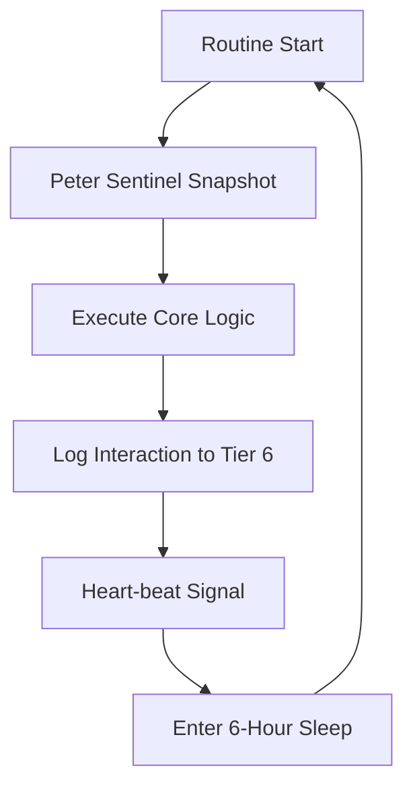

| **Document Control** |                                  |
| :------------------- | :------------------------------- |
| **Document Title**   | **Autonomous Routine Governance**|
| **Document ID**      | HWB-QMS-8.6-AUTO                 |
| **Version**          | 2.0.0                            |
| **Status**           | APPROVED                         |
| **Author**           | George (Architect)               |
| **Approved By**      | Humberto Dominguez, CEO          |
| **Date**             | 05/21/2026                       |
| **ISO 9001 Clause**  | 8.5 (Service Provision)          |

---

# Standard Operating Procedure: **Autonomous Routine Governance**

## 1.0 Purpose
To define the governance for autonomous "Loops" executed by AI agents. This ensures that background tasks (e.g. market harvesting, system checks) remain stable and within the **SigmaFidelity™** operational boundaries.

## 2.0 Universal Mandates (2026 Baseline)
1. **The 6-Hour Pulse:** All persistent agent loops must include a mandatory 6-hour sleep interval to prevent token runaway.
2. **Watchdog Active:** Every autonomous routine must be monitored by a non-looping Watchdog process.
3. **Tier 6 Telemetry:** Every loop start, heart-beat, and completion must be logged to the `SigmaInteractionLog`.

## 3.0 Governance Framework

### 3.1 Loop Architecture

### 3.2 Error Handling
If a loop encounters a fatal error:
1.  **Stop:** The loop must terminate immediately.
2.  **Alert:** Send a signal to the CEO via the Teams/Email alert hub.
3.  **Audit:** George must analyze the failure via Tier 6 logs before restarting.

## 4.0 Verification (Zero-Defect Check)
*   Loop uptime is >99%.
*   Interaction logs show consistent 6-hour heart-beats.

## 5.0 Revision History
| Version | Date | Author | Change Description |
| :--- | :--- | :--- | :--- |
| 2.0.0 | 05/21/2026 | George | TOTAL MODERNIZATION. Defined the 6-Hour Pulse and Watchdog mandates. |
| 1.0 | 2026-03-08 | George | Initial Routine Governance. |
