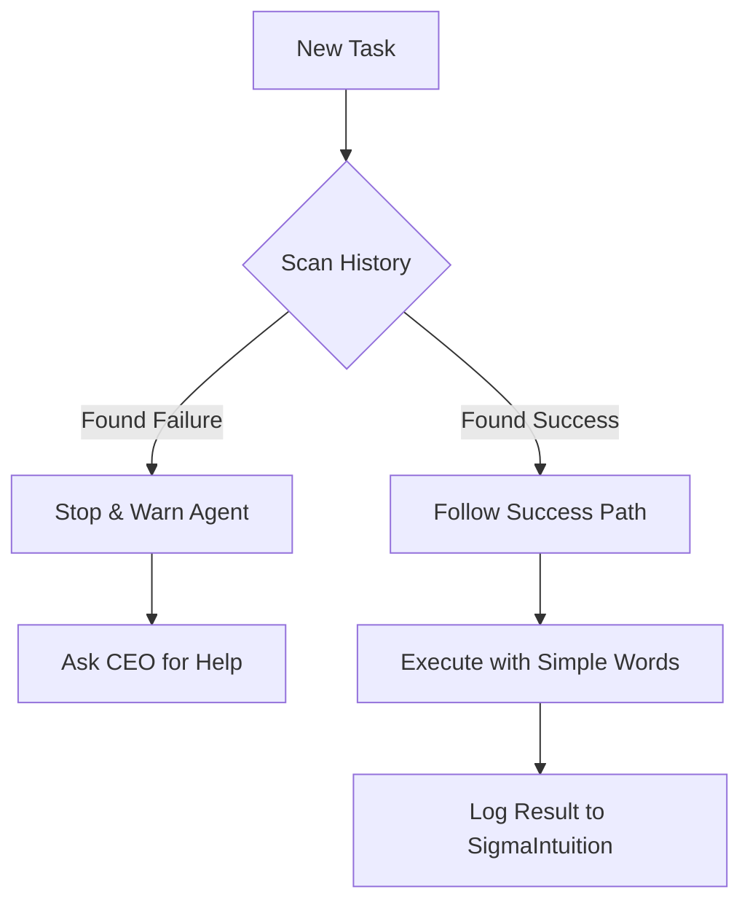

| **Document Control** |                                  |
| :------------------- | :------------------------------- |
| **Document Title**   | **Intuition Engine and Pattern Recognition** |
| **Document ID**      | HWB-QMS-9.4                      |
| **Version**          | 1.0.0                            |
| **Status**           | APPROVED                         |
| **Author**           | George (Architect)               |
| **Approved By**      | Humberto Dominguez, CEO          |
| **Date**             | 05/21/2026                       |
| **ISO 9001 Clause**  | 7.1.3 (Infrastructure)           |

---

# Standard Operating Procedure: **Intuition Engine and Pattern Recognition**

## 1.0 Purpose
To define the procedure for using the **Intuition Engine**. This system helps AI agents make fast, safe decisions by learning from previous mistakes and wins. It ensures the company stays safe and uses simple English for all work.

## 2.0 Scope
Applies to all AI agents and the **SigmaIntuition** database.

## 3.0 Universal Mandates (2026 Baseline)
1. **Gemini 1.5 Brain:** All intuition logic must use the Gemini 1.5 model for high-speed pattern matching.
2. **Simple Word Rule:** The engine must flag big PhD words and suggest everyday words.
3. **Pattern Matching:** Before doing a big task, the agent must check the database for past failures.

## 4.0 The Intuition Workflow

## 5.0 Procedure

### 5.1 Learning from Experience
1. Every time a problem is solved, the agent must log the **Problem**, the **Fix**, and the **Rule** into the `SigmaIntuition` table.
2. The agent must "score" the action to help the engine learn what works best.

### 5.2 Vocabulary Check
1. The engine scans all text for big academic words.
2. It automatically suggests simpler words that a 20-year-old manager can understand.

## 6.0 Verification (Zero-Defect Check)
*   The agent uses "Everyday Words" in 100% of its reports.
*   Zero repeated technical errors from previous sessions.

## 7.0 Notes and Cautions
> **NOTE:** Intuition is just "Fast Experience." It gets better the more we work together.
> **CAUTION:** Never trust a "feeling" that goes against the Physical Truth of the server.

## 8.0 Revision History
| Version | Date | Author | Change Description |
| :--- | :--- | :--- | :--- |
| 1.0.0 | 05/21/2026 | George | Initial Release. Established the Gemini 1.5 Intuition Engine and Simple Word rules. |
