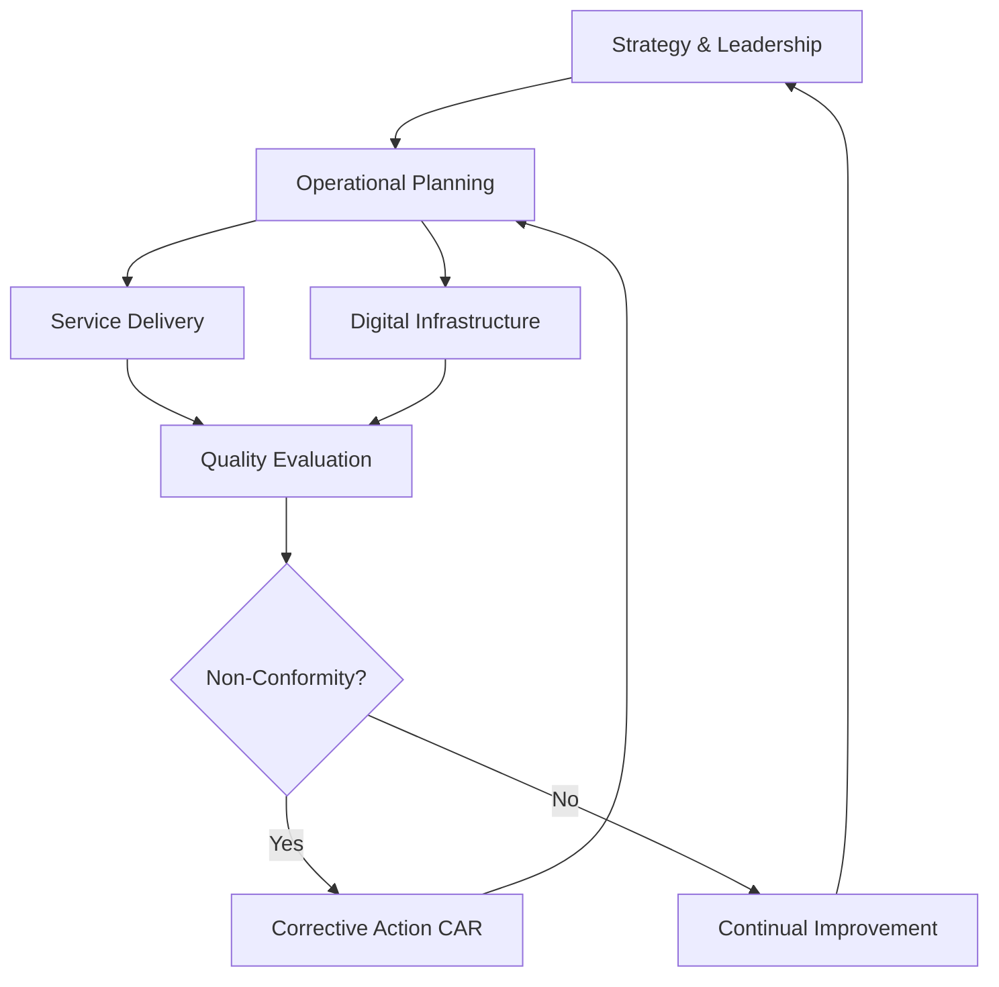

| **Document Control** |                                  |
| :------------------- | :------------------------------- |
| **Document Title**   | **Quality Management System Manual** |
| **Document ID**      | HWB-QMS-MASTER                   |
| **Version**          | 2.0.0                            |
| **Status**           | APPROVED                         |
| **Author**           | George (Architect)               |
| **Approved By**      | Humberto Dominguez, CEO          |
| **Date**             | 05/21/2026                       |
| **ISO 9001 Clause**  | All Clauses                      |

---

# **Quality Management System (QMS) Manual**

## 1.0 Introduction
This manual defines the Quality Management System for HWB Cleaning Services LLC. It is the main set of rules ensuring that our industrial cleaning services, AI management, and money management meet **ISO 9001:2015** standards and the **HWB** standard for work.

## 2.0 Universal Mandates (2026 Baseline)
All HWB work must follow these core rules:
1. **Physical Truth:** All digital and physical records must show real-world information.
2. **Guidance First:** AI team members must pause and ask for the boss's help before starting long searches.
3. **Activity Tracking:** Every major system decision and interaction must be saved to the database.
4. **Precise Updating:** Documentation and code must be updated carefully to prevent losing information.

## 3.0 Scope of the QMS
The QMS applies to all HWB business units, including:
*   **Operations:** Janitorial, Commercial, and specialized Data Center cleaning.
*   **Intelligence:** Autonomous AI team (George, CRM Specialist, Lauri, Peter, Natalie).
*   **Infrastructure:** Azure Cloud, Compliance System, and the main web entry point.

## 4.0 Leadership and Governance (Clause 5)
HWB leadership is committed to:
*   **The Operator Charter:** No fluff, no fake data—strictly real work.
*   **Accountability:** George (Lead Developer) is the main person in charge of ISO/QMS rules.
*   **Vision:** To provide high-quality building management through clinical precision.

## 5.0 Support (Clause 7)
*   **Infrastructure (7.1.3):** Independent system setup (Flask/Nginx) ensuring 100% manual uptime.
*   **Competence (7.2):** Formal training and certification tracking for all technical workers.
*   **Documented Information (7.5):** High-quality website parts served through the Compliance System.

## 6.0 Operation (Clause 8)
*   **Sales & CRM:** Separate lead lists to keep roles apart.
*   **Service Delivery:** Error-free field work managed by digital work orders and safety audits.

## 7.0 Improvement (Clause 10)
*   **Corrective Action:** Solving problems recorded in the `PROBLEMS-TO-SOLVE.md` list.
*   **Continual Improvement:** Regularly improving the "High-Quality System" using activity tracking feedback.

## 8.0 Process Flow Chart

## 9.0 Revision History
| Version | Date | Author | Change Description |
| :--- | :--- | :--- | :--- |
| 2.0.0 | 05/21/2026 | George | TOTAL MODERNIZATION. Integrated 2026 Baseline, Tier 6 mandates, and Microservice architecture. |
| 1.3 | 2026-02-21 | Gemini | Initial QMS setup. |
