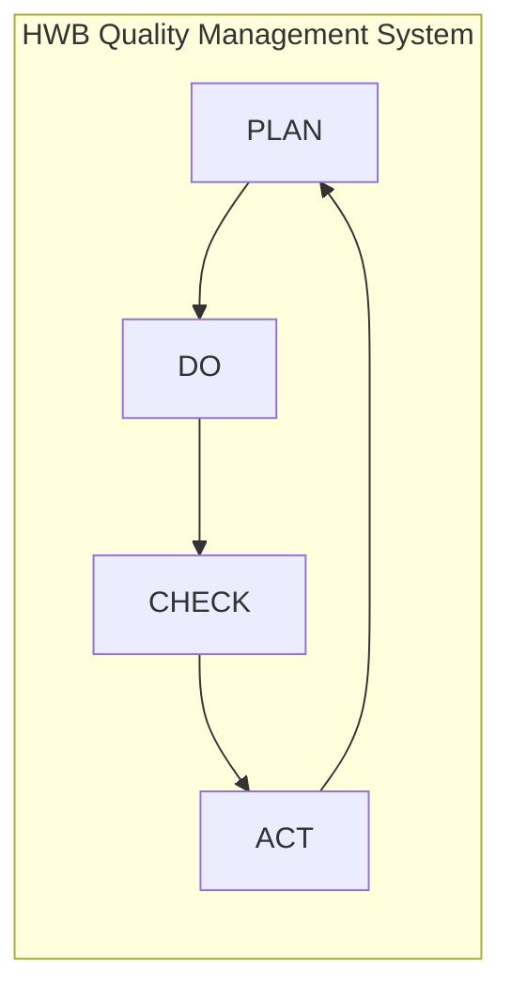

| **Document Control** | |
| :--- | :--- |
| **Document Title** | **ISO 9001 QMS Master Audit Mapping Flowchart** |
| **Document ID** | HWB-QMS-MASTER-MAP-001 |
| **Version** | 3.1 |
| **Status** | Draft |
| **Author** | Gemini |
| **Approved By** | _________________________ |
| **Date** | 2026-02-21 |

---

# ISO 9001:2015 Master Audit Mapping Flowchart

## 1.0 Purpose
This document provides a comprehensive visual mapping of the HWB Cleaning Services Quality Management System against the ISO 9001:2015 standard.

## 2.0 Procedure: Master PDCA Mapping

## 3.0 Audit Navigation Guide & Document Catalog
| ISO Clause | HWB Implementation Reference | Key Audit Evidence |
| :--- | :--- | :--- |
| **4.0 Context** | [[HWB-QMS-1.0 SigmaFidelity™ Company Charter.md\|SigmaFidelity™ Company Charter]] | Strategic intent and mission |
| **4.4 Processes** | [[mop_incident/sigma_iee_governance.md\|S4/IEE Data Governance]] | Value chain and 30k-foot reporting |
| **5.0 Charters** | [[HWB-QMS-FORM-008 S4-IEE Project Charter Template.md\|S4/IEE Project Charter Template]] | Project goals and resource allocation |
| **6.1 Planning** | [[HWB-QMS-STRAT-008 Project Arrow Diagram.md\|Project Arrow Diagram]] | Sequence, dependencies, and critical path |
| **7.4 Project Comm.**| [[HWB-QMS-7.4 Project Communication Plan.md\|Project Communication Plan]] | Structured update frequency |
| **8.0 Operation** | [[mop_incident/sigma_sipoc_report.md\|Daily SIPOC Report]] | Strategic value chain monitoring |
| **8.4 Purchasing** | [[HWB-QMS-8.4 Purchasing Process SOP with Flowchart.md\|Purchasing Process SOP]] | Selection, evaluation, and control of suppliers |
| **8.4 Inventory**  | [[mop_incident/app.py\|SDS & Chemical Registry (Admin)]] | Real-time control of chemical hazards |
| **9.1 Monitoring**  | [[mop_incident/sigma_performance_metrics.md\|KPOV/KPIV Performance Tracker]] | Data-driven performance monitoring |
| **10.2 Improvement**| [[HWB-QMS-STRAT-006 Strategic Why-Why Diagram.md\|Why-Why Diagram (Higgins 1995)]] | Deep analysis of causal chains |
| **10.3 Execution**  | [[HWB-QMS-STRAT-002 S4-IEE Execution Roadmap.md\|S4/IEE Execution Roadmap]] | Standard DMAIC path for projects |

## 4.0 Revision History
| Version | Date | Author | Description |
| :--- | :--- | :--- | :--- |
| 1.0 - 3.0 | 2026-02-21 | Gemini | [Cumulative QMS builds and mappings. reached Version 3.0 milestone.](#1-0-purpose) | 
| 3.1 | 2026-02-21 | Gemini | Formalized Purchasing Process (ISO 8.4) mapping. |
