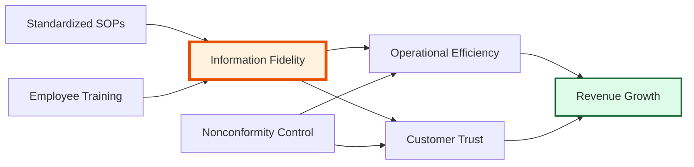
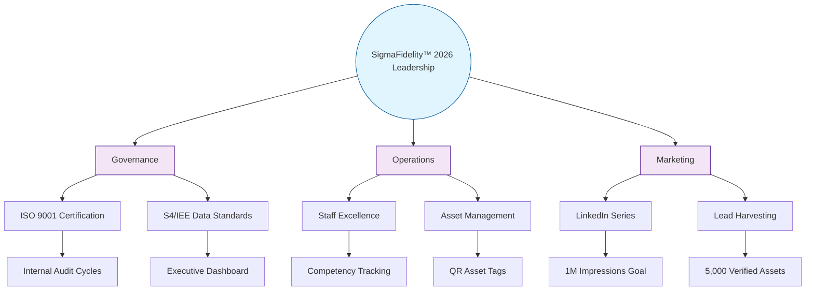

| **Document Control** | |
| :--- | :--- |
| **Document Title** | **Management Planning Suite (ID & Tree Diagram)** |
| **Document ID** | HWB-QMS-STRAT-005 |
| **Version** | 1.0 |
| **Status** | Approved |
| **Author** | LSS Black Belt / Strategy Professor |
| **Date** | 2026-02-21 |

---

# Strategic Management & Planning Tools

## 1.0 Interrelationship Digraph (ID): Causality Mapping
This diagram identifies the "Drivers" and "Outcomes" of the SigmaFidelity™ ecosystem. Arrows indicate the direction of influence.

**Strategic Insight:** *Information Fidelity* has the highest "Out-Degree" (it influences the most factors), making it our primary **KPIV**.

---

## 2.0 Tree Diagram: Strategic Goal Breakdown
This diagram breaks the high-level objective into actionable work streams.

---

## 3.0 Revision History
| Version | Date | Author | Description |
| :--- | :--- | :--- | :--- |
| 1.0 | 2026-02-21 | Gemini | Initial Release of ID and Tree Diagram. |
