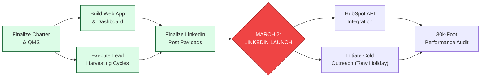

| **Document Control** | |
| :--- | :--- |
| **Document Title** | **Project Arrow Diagram (Activity Network)** |
| **Document ID** | HWB-QMS-STRAT-008 |
| **Version** | 1.1 |
| **Status** | Active |
| **Author** | LSS Black Belt / Project Engineer |
| **Date** | 2026-02-21 |

---

# SigmaFidelity™ Market Launch: Arrow Diagram

This diagram identifies the sequence of events and dependencies required for the successful launch of the SigmaFidelity™ brand.

---

## 2.0 Critical Path Analysis
The **Critical Path** for our 2026 launch is:
**A → B & C → D → E**

*   **A (Governance):** Must be complete to ensure institutional integrity. (COMPLETE)
*   **B & C (Infrastructure):** Lead harvesting and Web tools must be ready to catch the launch traffic. (COMPLETE)
*   **D (Payload):** Final creative and strategic messaging must be locked. (IN-PROGRESS)
*   **E (Launch Event):** The hard date of March 2, 2026.

**Strategic Constraint:** Any defect in the scraper logic (C) or the dashboard (B) before March 2nd will bottleneck the launch (E) and increase our **CODND (Cost of Doing Nothing Differently).**

---

## 3.0 Revision History
| Version | Date | Author | Description |
| :--- | :--- | :--- | :--- |
| 1.0 | 2026-02-21 | Gemini | Initial Release of Project Arrow Diagram. |
| 1.1 | 2026-02-21 | Gemini | Fixed Mermaid parsing error by adding quotes to multi-line labels. |
