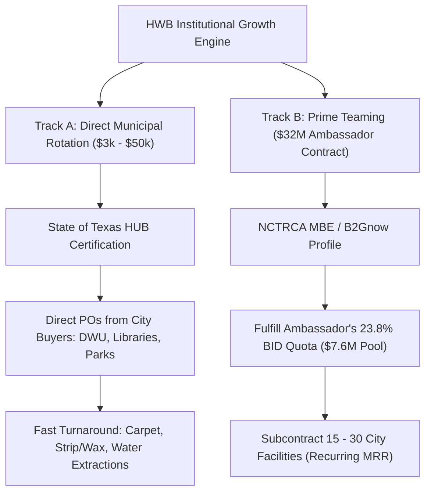

# 🏛️ City of Dallas Municipal Procurement & Teaming Playbook
**Document ID:** `HWB-PLAYBOOK-DAL-001`  
**Governing Standard:** `HWB-QMS-8.9` & `HWB-QMS-7.8`  
**Target Entities:** City of Dallas (Office of Procurement Services & BEH), Ambassador Services LLC ($32M Master ID/IQ)  
**Custodians:** George (Systems Architect & mbB) & Humberto Dominguez (CEO)  
**Date:** 09-22-2026  

---

## 1.0 Executive Blueprint: The Dual-Track Capture Model

To maximize revenue while controlling risk, HWB Cleaning Services LLC operates on two parallel tracks:



---

## 2.0 Priority Certification Action Plan

| Rank | Certification | Organization | Cost | Timeline | Key Revenue Unlock |
| :---: | :--- | :--- | :---: | :---: | :--- |
| **1** | **Joint NCTRCA MBE + Texas State HUB** | NCTRCA & Texas Comptroller | **$0** | 45–60 Days | Unlocks City of Dallas BID quotas, NTTA bids, and non-competitive $3k–$50k rotation calls. |
| **2** | **B2Gnow Profile Registration** | City of Dallas Diversity Portal | **$0** | 24 Hours | Positions HWB on the official certified subcontractor list pulled by prime bidders. |
| **3** | **Texas CMBL Listing** | Texas Comptroller of Public Accounts | **$70/yr** | Instant | Direct email invitations on state agency bids over $25,000 (TxDOT, Texas Universities). |
| **4** | **DFW MSDC MBE** | DFW Minority Supplier Council | **$350** | 45 Days | Private Fortune 500 corporate supply chains (Toyota, AT&T, American Airlines, CBRE). |
| **5** | **SBA 8(a) Development Program** | U.S. Small Business Administration | **$0** | 90–120 Days | Up to **$4.5 Million sole-source federal contracts** without competitive bidding. |

---

## 3.0 City of Dallas Portal Setup & Commodity Code Mapping

### 3.1 Bonfire Electronic Portal (`dallascityhall.bonfirehub.com`)
Ensure the HWB company profile is active and mapped to these 5 Texas Comptroller NIGP codes:
- **`910-39`**: Janitorial and Custodial Services (Core Daily Operations)
- **`962-58`**: Professional Cleaning Services, Interior / Post-Construction
- **`910-70`**: Pressure Washing and Exterior Washing
- **`910-25`**: Flooring Maintenance, Stripping, Waxing, and Polishing
- **`910-04`**: Air Duct Cleaning and HVAC Custodial Remediation

### 3.2 B2Gnow Diversity Portal (`dallas.diversitycompliance.com`)
- Primary NAICS: **`561720`** (Janitorial Services)
- Secondary NAICS: **`238990`** (All Other Specialty Trade Contractors - Post-Construction Cleaning)
- Primary NIGP: **`910-39`**

### 3.3 City Controller Vendor Number Issuance
When awarded an informal quote or subcontract:
1. Complete `Vendor_Registration_Form_Revised_03.14.2023_Fillable__002.pdf` (saved in `HWB-COMPANY/HWB-QUOTES/CITY-OF-DALLAS-PROCUREMENT/`).
2. Attach signed corporate W-9.
3. Transmit via email to: **`CODVendorRegistrations@dallas.gov`**.

---

## 4.0 Bidding Formulas & Margin Protection (Dallas Living Wage)

All City of Dallas proposals must be run through `core/services/estimator.py`:

```python
from core.services.estimator import calculate_institutional_bid

result = calculate_institutional_bid(
    cleanable_sqft=50000,
    mandated_weekly_hours=40.0,
    term_months=60,               # 5-Year Master Contract Term
    base_hourly_rate=18.00,       # City of Dallas Living Wage Floor
    target_margin=0.18,           # 18.0% Target Margin
    negotiation_buffer=0.03       # 3.0% Negotiation Cushion (Submits at 21.0%)
)
```

### The Three Protective Contract Clauses:
1. **Annual Living Wage Revision Clause:**
   > *"Contractor's pricing is predicated on the City of Dallas Living Wage baseline of $18.00/hr. If the City Council mandates an upward revision to the living wage floor during the 60-month term, billing rates shall adjust concurrently by the exact labor delta multiplied by statutory burden (1.20) plus standard G&A, pursuant to Texas Local Government Code § 252.0436."*
2. **One-Pass Continuous Cleaning Rule:**
   > *"Proposal covers scheduled daily custodial maintenance. Special event cleanings, storm flood extractions, or post-construction trade dust re-cleans shall be billed separately at HWB's contracted emergency rate of $38.50 per man-hour."*
3. **Bi-Level Waste Contamination Defense:**
   > *"HWB enforces rigid color-coded waste segregation (translucent blue for recyclables, black 2-mil for general trash). Contamination penalties assessed by municipal disposal facilities resulting from improper trash disposal by facility occupants shall not be backcharged to contractor."*

---

## 5.0 Major Prime Contractors in Texas (City of Dallas, Airports & GCs)

### 5.1 Institutional Custodial & Facility Management Primes
- **Ambassador Services, LLC:** Awarded **~$45.78 Million 5-Year Master Agreement** for Citywide Janitorial (`CSP-BYZ25-00028708`). Must subcontract **23.8% ($10.8M+)** to certified M/WBE partners. Target: Subcontract 15–30 facility clusters in North Dallas / Collin border.
- **Oriental Building Services, Inc.:** Major City of Dallas municipal prime contractor (courts, libraries, FREM facilities).
- **LGC Global Energy FM, LLC:** Prime contractor for municipal administration and Dallas Water Utilities (DWU) facilities.
- **ABM Aviation / ABM Industry Groups:** Custodial prime at **Dallas Love Field Airport (DAL)** and **DFW International Airport** concourses.
- **Flagship Facility Services:** Major aviation terminal maintenance contractor at DFW Airport.
- **Pritchard Industries Southwest:** Primary contractor for **Collin College ($14.5M master award)** and NCTCOG regional contracts.
- **SSC Services for Education (Compass Group):** University and school district custodial management across Texas.

### 5.2 Top Commercial Construction Primes (General Contractors)
When the City of Dallas, NTTA, or Dallas ISD build facilities, these GCs subcontract Division 01 post-construction clean:
- **Austin Commercial (Dallas HQ):** DFW Airport terminals, Dallas City Hall renovations, UT Southwestern. (25%–30% M/WBE quota).
- **Balfour Beatty (Dallas HQ):** NTTA service facilities, public high schools, civic centers. (20%–25% M/WBE quota).
- **Turner Construction (Dallas HQ):** Parkland Hospital, municipal safety complexes. (25%+ M/WBE quota).
- **The Beck Group (Downtown Dallas HQ):** Civic centers, university buildings, commercial towers. (20%–25% M/WBE quota).
- **Manhattan Construction (Dallas HQ):** DFW Airport expansions, stadium sports venues. (20%–25% M/WBE quota).
- **JE Dunn Construction (Dallas):** Municipal court facilities, police headquarters. (20%–25% M/WBE quota).
- **DPR Construction (Dallas):** Technology centers, data facilities, healthcare. (15%–20% SBE quota).
- **McCarthy Building Companies (Dallas):** DWU water treatment plants, major infrastructure. (20%–25% M/WBE quota).

---

## 6.0 Key City Hall Contacts

| Name | Role | Email | Phone |
| :--- | :--- | :--- | :--- |
| **Aliyah Wells** | Contract Analyst, Business Enterprise Hub (BEH) | `aliyah.wells@dallas.gov` | (214) 671-5116 |
| **Kevin Crampton** | Procurement Official, Office of Procurement Services | `kevin.crampton@dallas.gov` | City Hall 3FN |
| **Vendor Registration** | Controller's Office | `CODVendorRegistrations@dallas.gov` | City Hall |

---

## 7.0 30-60-90 Day Execution Checklist

- [ ] **Day 1–15:** Complete joint NCTRCA MBE + Texas State HUB online application.
- [ ] **Day 1–15:** Log into Bonfire (`dallascityhall.bonfirehub.com`) and confirm all 5 commodity codes are mapped.
- [ ] **Day 1–15:** Set up HWB profile on Dallas B2Gnow diversity portal under NAICS `561720`.
- [ ] **Day 16–30:** Send executive letterhead to Aliyah Wells (`aliyah.wells@dallas.gov`) requesting the follow-up meeting at 1500 Marilla St.
- [ ] **Day 31–60:** Provide Texas HUB certificate number to buyers in Dallas Water Utilities and Library branches for informal quote rotation ($3k–$50k).
- [ ] **Day 61–90:** Initiate teaming outreach to Ambassador Services LLC and Austin Commercial to position HWB as their certified local M/WBE partner.
