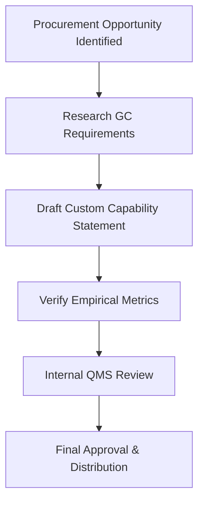

| **Document Control** |                                              |
| :------------------- | :------------------------------------------- |
| **Document Title**   | **Capability Statement Development SOP**     |
| **Document ID**      | HWB-MKT-001                                  |
| **Version**          | 1.0                                          |
| **Status**           | Approved                                     |
| **Author**           | Gemini (Senior ISO 9001 Auditor)             |
| **Approved By**      | SigmaFidelity™ Orchestrator                  |
| **Date**             | 2026-03-01                                   |

---

# Standard Operating Procedure: **Capability Statement Development**

## 1.0 Purpose
To define the standardized procedure for creating and maintaining the HWB Cleaning Services LLC Capability Statement. This document serves as the primary technical proposal for General Contractors (GCs) and government entities, demonstrating HWB's ISO 9001 compliance and operational excellence.

## 2.0 Scope
Applies to all marketing and sales personnel responsible for business development in the commercial and post-construction sectors.

## 3.0 Prerequisites
*   Verified company metrics (Cpk, DPMO) from the Sigma Orchestrator.
*   Current list of certifications (e.g., HUB, Minority-Owned).
*   High-resolution company logos and project photography.

## 4.0 Procedure

### 4.1 Core Content Requirements
Every Capability Statement must contain the following five sections:
1.  **Core Competencies:** Focused list of specialized services (e.g., Post-Construction, Biohazard, Medical Office).
2.  **Past Performance:** List of at least three major projects with general contractor names and completion dates.
3.  **Differentiators:** Explicit mention of "SigmaFidelity™ Data Integrity" and "ISO 9001:2015 Registered QMS."
4.  **Company Data:** DUNS/UEI numbers, NAICS codes (e.g., 561720), and bonding capacity.
5.  **Contact Information:** Professional contact details and website URL.

### 4.2 Customization for GCs
1.  **Research:** Identify the specific project (e.g., Universal Kids Resort) and the lead general contractor.
2.  **Tailoring:** Adjust the "Past Performance" section to highlight projects of similar scope or vertical.
3.  **Audit Check:** Ensure all data provided is empirical and reflects current operational readiness.

### 4.3 Review and Approval
1.  **Technical Review:** The Lead Autonomous Agent shall verify that all technical claims align with the **Zero Synthetic Data Policy**.
2.  **Final Approval:** Managing Director approval is required before distribution to external procurement offices.

### 4.4 [Process Flow Chart]

## 5.0 Verification
*   Monthly audit of distributed statements for accuracy.
*   Successful inclusion on GC "Approved Vendor" lists.

## 6.0 Notes and Cautions
*   **Version Control:** Ensure the statement is updated quarterly to reflect the latest SigmaFidelity™ metrics.

## 7.0 Revision History
| Version | Date | Author | Change Description |
| :--- | :--- | :--- | :--- |
| 1.0 | 2026-03-01 | Gemini | Initial Release: Formalized marketing standards. |
