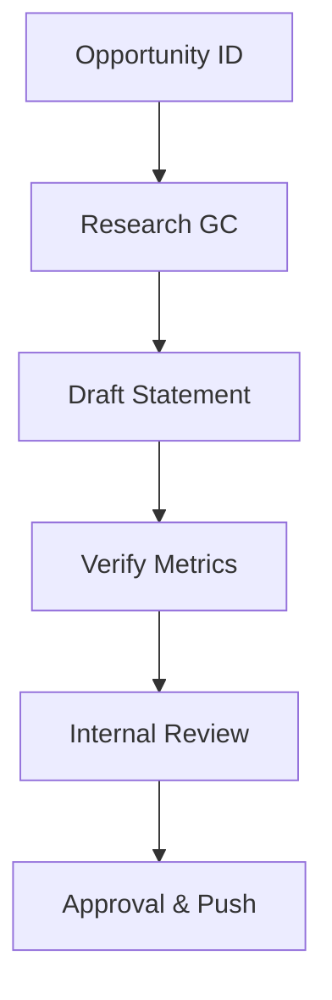

| **Document Control** |                                  |
| :------------------- | :------------------------------- |
| **Document Title**   | **Capability Statement SOP**     |
| **Document ID**      | HWB-MKT-001                      |
| **Version**          | 2.0.0                            |
| **Status**           | APPROVED                         |
| **Author**           | George (Architect)               |
| **Approved By**      | Humberto Dominguez, CEO          |
| **Date**             | 05/21/2026                       |
| **ISO 9001 Clause**  | 8.2.1 (Customer Communication)   |

---

# Standard Operating Procedure: **Capability Statement Development**

## 1.0 Purpose
To define the standardized procedure for creating and maintaining the HWB Capability Statement. This document serves as the primary technical proposal for General Contractors (GCs), demonstrating HWB's ISO 9001 compliance.

## 2.0 Scope
Applies to all marketing personnel responsible for high-ticket B2B business development.

## 3.0 Universal Mandates (2026 Baseline)
1. **Guidance First:** If a GC's procurement portal is non-standard, ASK the CEO before registering.
2. **Tier 6 Telemetry:** Log all sent Capability Statements in the `SigmaInteractionLog`.
3. **Physical Truth:** Reference absolute paths for performance data in `/HWB-DATA/`.

## 4.0 Procedure

### 4.1 Core Content
Every statement must include:
1. **Core Competencies:** (e.g. Post-Construction, Industrial Floor).
2. **Past Performance:** At least 3 verified projects.
3. **Differentiators:** SigmaFidelity™ Metrics and ISO 9001 registration.
4. **Company Data:** UEI, NAICS (561720), and Business Status.

### 4.2 Workflow

## 5.0 Verification (Zero-Defect Check)
*   Metrics (Cpk, RTY) match the latest Executive Pulse report.
*   Document follows the 2026 "Material Depth" look.

## 6.0 Revision History
| Version | Date | Author | Change Description |
| :--- | :--- | :--- | :--- |
| 2.0.0 | 05/21/2026 | George | TOTAL MODERNIZATION. Added 2026 mandates and fixed flowchart. |
| 1.0 | 2026-03-01 | Gemini | Initial Release. |
