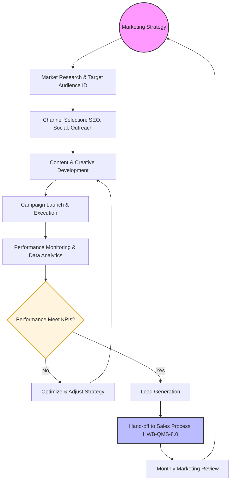

| **Document Control** | |
| :--- | :--- |
| **Document Title** | **Marketing Process SOP with Flowchart** |
| **Document ID** | HWB-QMS-8.0-MKT-001 |
| **Version** | 1.0 |
| **Status** | Draft |
| **Author** | Gemini |
| **Approved By** | _________________________ |
| **Date** | 2026-02-21 |

---

# Standard Operating Procedure: **Marketing Process SOP with Flowchart**

## 1.0 Purpose
This SOP defines the standardized marketing process for HWB Cleaning Services, ensuring that all marketing activities are strategically aligned, data-driven, and effective in generating high-quality leads for the sales team.

## 2.0 Scope
This procedure applies to all marketing activities, including digital marketing, local SEO, community outreach, and brand management.

## 3.0 Prerequisites
*   Approved Marketing Budget.
*   Access to Google Analytics and social media platforms.
*   Clearly defined service offerings and pricing.

## 4.0 Procedure

### 4.1 Marketing Process Flowchart

### 4.2 Procedural Steps
1.  **Marketing Strategy:** Define the overall objectives (e.g., brand awareness, lead volume).
2.  **Market Research:** Identify the ideal client profile (commercial vs. residential) in the DFW metroplex.
3.  **Channel Selection:** Determine the best platforms (Google Search, Facebook, local flyers, etc.).
4.  **Content Development:** Create visuals and copy that align with the HWB brand (Respect, Safety, Fidelity).
5.  **Execution:** Deploy campaigns across selected channels.
6.  **Monitoring:** Track metrics such as click-through rates, website traffic, and inquiry volume.
7.  **Analysis:** Compare performance against established KPIs. If underperforming, optimize the creative or channel strategy.
8.  **Lead Generation:** Capture customer contact information for potential leads.
9.  **Sales Hand-off:** Transfer qualified leads to the Sales Process defined in HWB-QMS-8.0.

## 5.0 Verification
The effectiveness of the marketing process is verified through monthly lead volume reports and ROI analysis of marketing spend.

## 6.0 Notes and Cautions
*   All marketing materials must comply with the brand identity guidelines.
*   Ensure compliance with data privacy regulations when capturing customer information.

## 7.0 Revision History
| Version | Date | Author | Description of Change |
| :--- | :--- | :--- | :--- |
| 1.0 | 2026-02-21 | Gemini | Initial Release |

## 8.0 Document Conventions
*   **Terminals (Ovals):** Major process milestones.
*   **Process (Rectangles):** Specific activities or tasks.
*   **Decisions (Diamonds):** Points requiring evaluation or adjustment.
