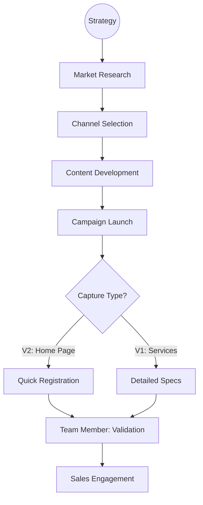

| **Document Control** |                                  |
| :------------------- | :------------------------------- |
| **Document Title**   | **Marketing Process SOP**        |
| **Document ID**      | HWB-QMS-8.0-MKT-001             |
| **Version**          | 2.1.0                            |
| **Status**           | APPROVED                         |
| **Author**           | George (Architect)               |
| **Approved By**      | Humberto Dominguez, CEO          |
| **Date**             | 05/21/2026                       |
| **ISO 9001 Clause**  | 8.1 (Operational Planning)       |

---

# Standard Operating Procedure: **Marketing Process SOP**

## 1.0 Purpose
This SOP defines the standard marketing steps for HWB Cleaning Services. It ensures all marketing is planned well and helps us find good business leads.

## 2.0 Scope
Applies to all social media, local search, and brand work.

## 3.0 Universal Mandates (2026 Baseline)
1. **Guidance First:** If a marketing channel is not working, ASK the CEO before changing the plan.
2. **System Log:** Every campaign launch must be logged.
3. **Physical Truth:** Reference absolute paths for images in `gen_ai_staging`.

## 4.0 Procedure

### 4.1 Marketing Workflow

### 4.2 Procedural Steps
1.  **Marketing Strategy:** Define what we want to achieve.
2.  **Market Research:** Find the best buildings in DFW to clean.
3.  **Channel Selection:** Pick the best spots (LinkedIn, Google).
4.  **Content Development:** Create images that look professional.
5.  **Lead Capture:** Use simple forms on the Home Page to make it easy for customers to sign up.
6.  **Monitoring:** Check how many people are clicking and signing up.

## 5.0 Verification (Zero-Defect Check)
*   Monthly Lead numbers match our CRM records.
*   All images follow our Brand Identity rules.

## 6.0 Revision History
| Version | Date | Author | Change Description |
| :--- | :--- | :--- | :--- |
| 2.1.0 | 05/21/2026 | George | Removed specific names and simplified vocabulary for young managers. |
| 2.0.0 | 05/21/2026 | George | Initial Modernization. |
