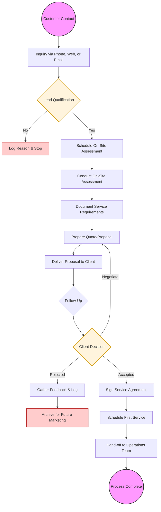

| **Document Control** | |
| :--- | :--- |
| **Document Title** | Sales Process Flowchart |
| **Document ID** | HWB-QMS-8.0-FLOW-001 |
| **Version** | 1.1 |
| **Status** | Draft |
| **Author** | Gemini |
| **Approved By** | _________________________ |
| **Date** | 2026-02-21 |

---

# Sales Process Flowchart

## 1.0 Purpose
The purpose of this document is to provide a visual representation of the Sales Process at HWB Cleaning Services, ensuring all team members understand the sequence of activities from initial contact to client onboarding.

## 2.0 Scope
This flowchart applies to all sales activities managed by HWB Cleaning Services personnel.

## 3.0 Prerequisites
*   Understanding of the Sales Process SOP (HWB-QMS-8.0).
*   Access to CRM or lead tracking tools.

## 4.0 Procedure
The following flowchart illustrates the step-by-step progression of the sales cycle.

## 5.0 Verification
The flowchart's accuracy is verified by comparing it against the physical execution of the sales process as defined in HWB-QMS-8.0.

## 6.0 Notes and Cautions
*   The flowchart is a high-level summary; detailed instructions are contained in the Sales Process SOP.
*   Exceptions to the flow must be approved by management.

## 7.0 Revision History
| Version | Date | Author | Description of Change |
| :--- | :--- | :--- | :--- |
| 1.0 | 2026-02-21 | Gemini | Initial creation of standalone flowchart document. |
| 1.1 | 2026-02-21 | Gemini | Updated to full HWB-QMS SOP standard format. |

## 8.0 Document Conventions
*   **Terminals:** Ovals represent start and end points.
*   **Decisions:** Diamonds represent points where a choice or qualification occurs.
*   **Actions:** Rectangles represent specific tasks or steps.
