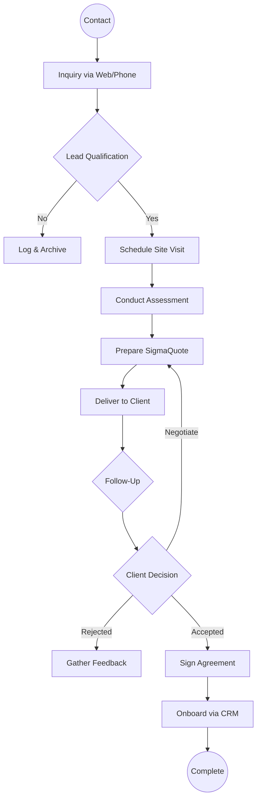

| **Document Control** |                                  |
| :------------------- | :------------------------------- |
| **Document Title**   | **Sales Process Flowchart**      |
| **Document ID**      | HWB-QMS-8.0-FLOW-001             |
| **Version**          | 2.0.0                            |
| **Status**           | APPROVED                         |
| **Author**           | George (Architect)               |
| **Approved By**      | Humberto Dominguez, CEO          |
| **Date**             | 05/21/2026                       |
| **ISO 9001 Clause**  | 8.2.1 (Customer Communication)   |

---

# Standard Operating Procedure: **Sales Process Flowchart**

## 1.0 Purpose
This document provides a visual representation of the Sales Process at HWB Cleaning Services, ensuring all team members understand the sequence of activities from initial contact to client onboarding.

## 2.0 Scope
Applies to all sales activities within the Lead Pipeline and CRM modules.

## 3.0 Universal Mandates (2026 Baseline)
1. **Guidance First:** If a lead's requirements are ambiguous, ASK the CEO before generating a quote.
2. **Tier 6 Telemetry:** Every transition in this flowchart must be traceable in the `SigmaInteractionLog`.
3. **Physical Truth:** Reference absolute paths for the quote generator logic (`quote_form.html`).

## 4.0 The Sales Sequence

## 5.0 Verification (Zero-Defect Check)
*   The flowchart renders correctly in the Compliance Engine.
*   Every accepted agreement results in a valid Account record.

## 6.0 Revision History
| Version | Date | Author | Change Description |
| :--- | :--- | :--- | :--- |
| 2.0.0 | 05/21/2026 | George | TOTAL MODERNIZATION. Added 2026 Baseline and Tier 6 mandates. |
| 1.1 | 2026-02-21 | Gemini | Initial Release. |
