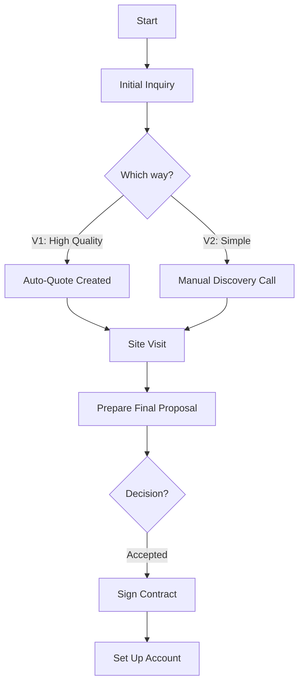

| **Document Control** |                                  |
| :------------------- | :------------------------------- |
| **Document Title**   | **Sales Process SOP**            |
| **Document ID**      | HWB-QMS-8.0                      |
| **Version**          | 2.0.0                            |
| **Status**           | APPROVED                         |
| **Author**           | George (Architect)               |
| **Approved By**      | Humberto Dominguez, CEO          |
| **Date**             | 05/21/2026                       |
| **ISO 9001 Clause**  | 8.2.1 (Customer Communication)   |

---

# Standard Operating Procedure: **Sales Process SOP**

## 1.0 Purpose
This SOP defines the standard process for managing sales inquiries from first contact to signing a new client, making sure every potential customer has a professional experience.

## 2.0 Scope
Applies to all HWB staff involved in managing leads, giving quotes, and getting new clients in the CRM area.

## 3.0 Universal Mandates (2026 Baseline)
1. **Ask First:** If a lead's building type is not on the standard list, ASK the boss before entering it manually.
2. **Activity Tracking:** Every change in a lead's status must be recorded.
3. **Physical Truth:** Use exact file paths for Lead Uploader scripts.

## 4.0 The Sales Sequence

### 4.1 How we get leads
1.  **Option 1 (High Quality):** Captured through specific service pages. Includes size and usage data for an instant $0.12 quote.
2.  **Option 2 (Simple Contact):** Captured through the Home Page. Includes Company and Contact data only. **Required Follow-up:** A CRM Specialist must contact these leads within 4 business hours to check the building type and size.

### 4.2 Workflow

### 4.2 Procedural Steps
1.  **Initial Inquiry:** Record all calls, web forms, or emails into the CRM.
2.  **Qualify Lead:** Check that the client is in our North Texas service area.
3.  **Schedule Assessment:** For good leads, set up a time to visit the building.
4.  **Conduct Assessment:** Visit the site and record the exact size and work needed.
5.  **Prepare Proposal:** Create a formal quote using the HWB $0.12 price engine.
6.  **Send and Follow-Up:** Send the proposal and check back within 48 hours.

## 5.0 Verification (Zero-Defect Check)
*   Signed agreement is uploaded to the Account record.
*   Client data in CRM matches the final service agreement.

## 6.0 Notes and Cautions
> **NOTE:** Use "Everyday Words" when explaining technical sanitation to clients.
> **CAUTION:** Never bypass the $0.12 formula without CEO approval.

## 7.0 Revision History
| Version | Date | Author | Change Description |
| :--- | :--- | :--- | :--- |
| 2.0.0 | 05/21/2026 | George | TOTAL MODERNIZATION. Standardized ID to HWB-QMS-8.0 and added Tier 6 mandates. |
| 1.0 | 2026-02-20 | Gemini | Initial Release. |
