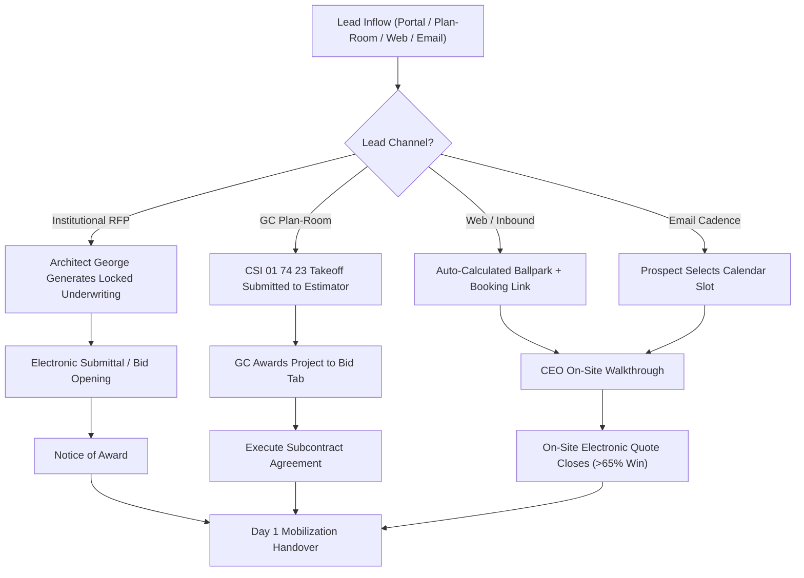

| **Document Control** |                                  |
| :------------------- | :------------------------------- |
| **Document Title**   | **Sales Process SOP**            |
| **Document ID**      | HWB-QMS-8.0                      |
| **Version**          | 2.0.0                            |
| **Status**           | APPROVED                         |
| **Author**           | George (Architect)               |
| **Approved By**      | Humberto Dominguez, CEO          |
| **Date**             | 05/21/2026                       |
| **ISO 9001 Clause**  | 8.2.1 (Customer Communication)   |

---

# Standard Operating Procedure: **Sales Process SOP**

## 1.0 Purpose
This SOP defines the standard process for managing sales inquiries from first contact to signing a new client, making sure every potential customer has a professional experience.

## 2.0 Scope
Applies to all HWB staff involved in managing leads, giving quotes, and getting new clients in the CRM area.

## 3.0 Universal Mandates (2026 Baseline)
1. **Ask First:** If a lead's building type is not on the standard list, ASK the boss before entering it manually.
2. **Activity Tracking:** Every change in a lead's status must be recorded.
3. **Physical Truth:** Use exact file paths for Lead Uploader scripts.

## 4.0 The Zero-Caller Sales Sequence

### 4.1 Acquisition Channels (Asynchronous & Inbound Pull)
1.  **Channel 1 (Institutional RFPs/RFBs):** Public procurement portals (NTTA, TxDOT, Counties, ISDs). Automated bid scraping and locked underwriting. Zero phone calls.
2.  **Channel 2 (Commercial GC Plan-Rooms - CSI 01 74 23):** Plan invitations via BuildingConnected, Procore, and CivCast. Submits standardized takeoff proposals directly to GC estimators.
3.  **Channel 3 (Automated Compliance Cadences):** Sector-specific email sequences (Lauri Tells Engine) targeting verified facility decision-makers (Daycares, Medical, Schools) with embedded Microsoft Bookings links.
4.  **Channel 4 (Frictionless Web Self-Qualification):** Interactive square-foot pricing calculator on `hwbcleaning.com` with instant ballpark range and immediate calendar walkthrough booking.

### 4.2 Workflow

```mermaid
graph TD
    A["Lead Inflow (Portal / Plan-Room / Web / Email)"] --> B{"Lead Channel?"}
    B -- Institutional RFP --> C["Architect George Generates Locked Underwriting"]
    B -- GC Plan-Room --> D["CSI 01 74 23 Takeoff Submitted to Estimator"]
    B -- Web / Inbound --> E["Auto-Calculated Ballpark + Booking Link"]
    B -- Email Cadence --> F["Prospect Selects Calendar Slot"]
    C --> G["Electronic Submittal / Bid Opening"]
    D --> H["GC Awards Project to Bid Tab"]
    E --> I["CEO On-Site Walkthrough"]
    F --> I
    G --> J["Notice of Award"]
    H --> K["Execute Subcontract Agreement"]
    I --> L["On-Site Electronic Quote Closes (>65% Win)"]
    J --> M["Day 1 Mobilization Handover"]
    K --> M
    L --> M
```

### 4.3 Procedural Steps
1.  **Asynchronous Lead Capture:** System ingests portal solicitations, GC plan room invitations, and inbound web forms into PostgreSQL CRM (`crm.db`).
2.  **Deterministic Qualification:** Algorithm checks physical location within North Texas service area and verifies minimum threshold.
3.  **Self-Scheduled Walkthrough / Automated Takeoff:** Prospect selects a walkthrough window via Microsoft Bookings, or estimator submits electronic plan takeoff.
4.  **Conduct Assessment:** CEO Humberto Dominguez conducts in-person walkthrough, verifies cleanable square footage, and inspects flooring substrates.
5.  **Deliver Proposal:** Submit formal proposal within 2 hours using the SigmaFidelity™ pricing engine.
6.  **Contract Execution:** Digital sign-off via DocuSign/SignNow; account automatically created in backoffice operations.

## 5.0 Verification (Zero-Defect Check)
*   Signed agreement is uploaded to the Account record.
*   Client data in CRM matches the final service agreement.
*   Zero manual telephone cold calling performed or required.

## 6.0 Notes and Cautions
> **NOTE:** Use "Everyday Words" when explaining technical sanitation to clients.
> **CAUTION:** Never bypass the $0.12 formula without CEO approval.

## 7.0 Revision History
| Version | Date | Author | Change Description |
| :--- | :--- | :--- | :--- |
| 2.1.0 | 09/18/2026 | George | ZERO-CALLER PIVOT. Eliminated remote telemarketing and discovery call bottlenecks; formalized 4-Pillar Asynchronous Engine. |
| 2.0.0 | 05/21/2026 | George | TOTAL MODERNIZATION. Standardized ID to HWB-QMS-8.0 and added Tier 6 mandates. |
| 1.0 | 2026-02-20 | Gemini | Initial Release. |
